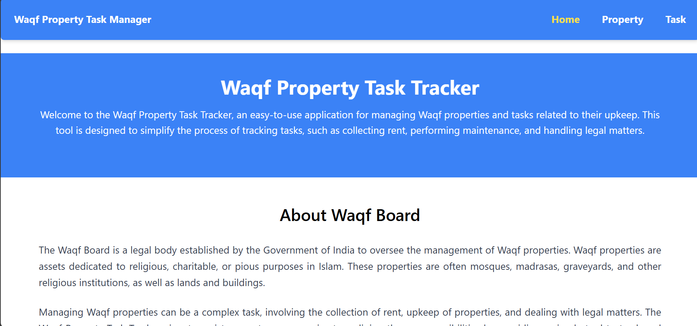
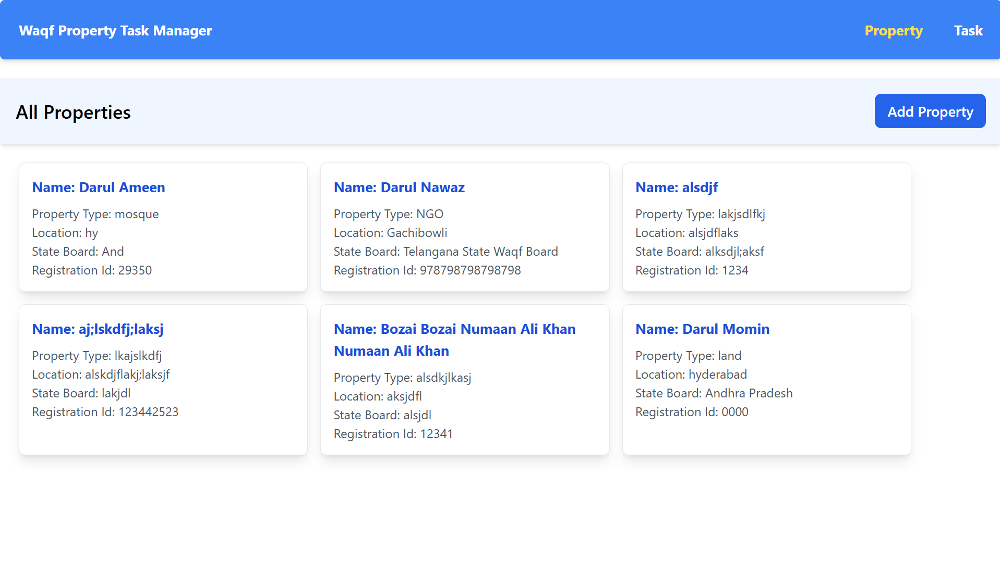
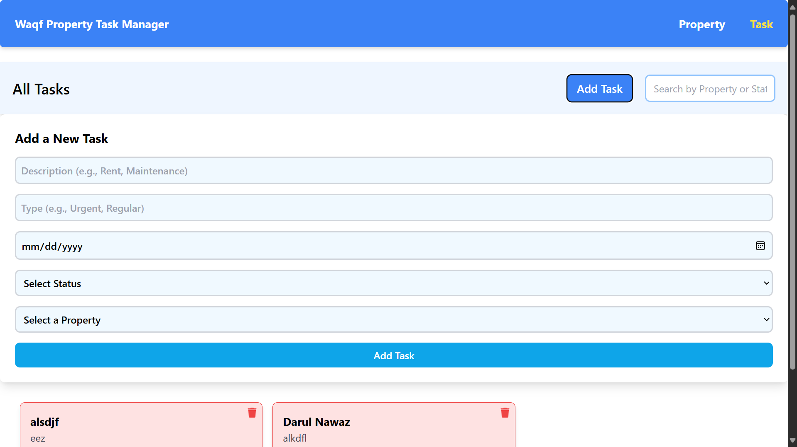

Waqf Property Task Tracker
A simple application to help Waqf property managers track basic tasks related to property management.

Application Demo:

Home Page:

Property Page:

Add Property:

Tasks Page:

Summary:

Developed the front-end using React, creating a responsive and intuitive user interface.
Utilized MongoDB to store and retrieve Properties, ensuring fast and reliable access.
Added functionality for users to perform CRUD operations on the Data.
Added functiomality to filter the data.

Prerequisites
Before you begin, ensure that you have the following installed:
VS Code (latest version recommended)
Node.js or any other required runtime (version X.X.X or higher)
Git (optional, if cloning from a repository)
Any other dependencies specific to your application (e.g., Python, Docker, etc.)

Setup Instructions
Clone the Repository:-
use the following command to clone the repositiory:- 
--bash git clone https://github.com/numaanalikhan/Waqf-Property-Task-Manager 
--cd [repo-folder]

Open the Project in VS Code:-
code .
Install Dependencies:- npm install
Run the Application:- 
a) Run Backend Server: Terminal-->cd backend-->npm start
b) Run FrontEnd server: Terminal-->cd my-app -->npm start
Access the Application:- Typically, it will run on: "http://localhost:5000"